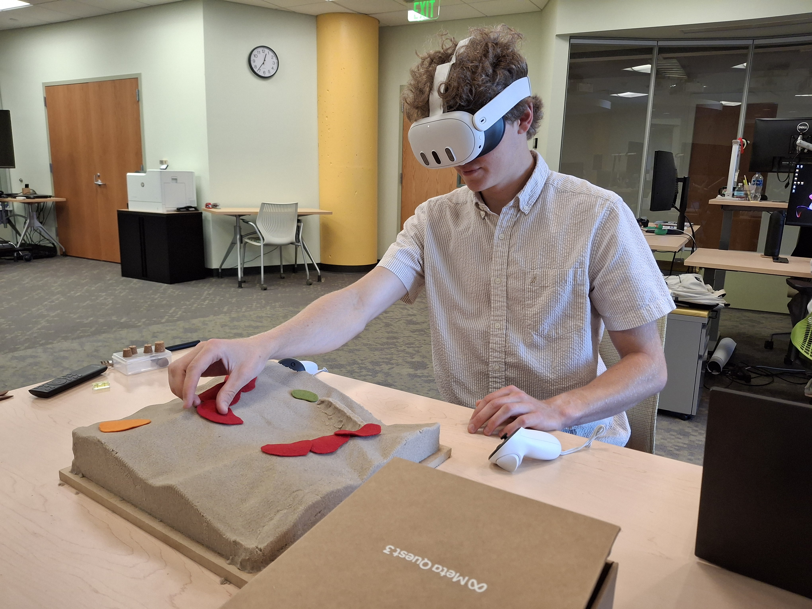

Tangible Landscape
==================


Tangible Landscape is an open source tangible interface for geospatial modeling powered by GRASS GIS. Tangible Landscape couples a physical model with a digital model of a landscape so that you can naturally feel, reshape, and interact with the landscape. This makes geographic information systems (GIS) far more intuitive and accessible for beginners, empowers geospatial experts, and creates new opportunities for developers.

This repository contains Tangible Landscape plugin for GRASS GIS, which allows
a real-time feedback cycle of interaction, 3D scanning, point cloud processing, geospatial computation and projection

<p align="center">
</p>

Installation:
----------------------------------
We support installation on Ubuntu 18.04. Tangible Landscape requires Microsoft Kinect for Xbox (v2) or Kinect for Azure. Software dependencies include:

-   GRASS GIS >= 8.2
-   GRASS GIS addon [r.in.kinect](https://github.com/ncsu-osgeorel/r.in.kinect): choose version depending on your sensor.
-   Python package [watchdog](https://pypi.python.org/pypi/watchdog), optionally [matplotlib](https://matplotlib.org/)

1. Make a folder where all the dependencies will be compiled:

       mkdir tangiblelandscape && cd tangiblelandscape

2. Download [one of the install scripts](https://github.com/tangible-landscape/tangible-landscape-install) based on your sensor to that folder and run it:

       sh install_Ubuntu-20.04_k4a.sh

    It will ask you for administrator password. You need to be online to download all dependencies. After finishing the process, log out and log in.

3. Find GRASS GIS in Dash and start it. Create a new GRASS Location or use an existing one, and when GRASS Layer Manager opens, go to tab Console and type:

       g.gui.tangible


<p align="center">
</p>

**Virtual Reality Set-Up**


**Prerequisites:**
* Oculus Meta Quest 3 (Headset)
* Computer Running Ubuntu (PC)
* Phone for Setup Purposes

**Installation**
1. Blender Installation (PC)
    1. Install Blender 5.0.1 or similar
    2. Install and configure the Tangible Landscape Blender Addon
    3. Enable the "VR Scene Inspection" Blender Addon 
2. Steam Installation (PC)
    1. Install Steam on your PC ```sudo apt install update && sudo apt install steam```
    2. From Steam, install Steam VR
3. Air Light VR Installation (PC)
    1. Install the ALVR Linux Launcher from ```https://github.com/alvr-org/ALVR/releases/```, look for ```alvr_launcher_linux.tar.gz```
    2. Unzip and run ```ALVR Launcher.exe```
    3. Press "Add Version" and select the latest version
    4. Remember this version for the headset and accept the default install parameters
6. Air Light VR Streamer Installation (Headset)
    1. To setup the headset initially, you'll need a Meta Account. The headset guides you through this process at the initial usage.   
    2. On the headset, go the app store and install the same ALVR version as the PC

**Running Virtual Reality**
1. General Setup (Headset, PC)
    1. Ensure that both the Headset and PC are connected to the same local WiFi network
    2. Enable bluetooth for both devices
2. Tangible Landscape Setup (PC)
    1. Run ```g.gui.tangible``` in your GRASS location
    2. Run Blender with the Tangible Landscape addon started
3. Steam Setup (PC)
    1. Run Steam
    2. From Steam, launch Steam VR
3. ALVR Launcher Setup (PC)
    1. Run ```ALVR Launcher.exe```
    2. Click "Launch" next to your installed version
    3. Ensure that ALVR sees the instance of Steam VR that's currently running
5. ALVR Streamer Setup (Headset, PC)
    1. Ensure that no apps are running on the headset
    2. Run ALVR, you should see a hostname and IP address for the headset
    3. In ALVR on your PC, select "Add Device Manually" next to "Trusted Wireless Devices"
    4. Input the hostname and IP Address shown in the headset
6. Starting Activity (PC)
    1. 2-Way streaming should be started at this point, and you can confirm by looking at the headset pose on SteamVR
    2. In Blender, in the VR Addon, select "Start VR Session" to begin streaming your Blender model to the Headset

**Common Issues**

`ERROR * profile does not contain encoding entrypoint. Your gpu may not suport encoding with this. `

This error happens on systems with both an integrated GPU and an external GPU. SteamVR tries to use the integrated GPU, which often doesn't support the specific image encoding methods that ALVR uses. To fix this,
1. Ensure the codec in ALVR settings is set to H.264
2. Launch Ubuntu on Wayland (This may not be necessary, but doesn't hurt in my testing) (Requires restart)
3. Open Steam -> SteamVR -> Manage (Gear Icon) -> Properties -> General -> Launch Options and enter this (replace the path with your SteamVR installation)
```
__GLX_VENDOR_LIBRARY_NAME=nvidia __NV_PRIME_RENDER_OFFLOAD=1 VK_DRIVER_FILES=/usr/share/vulkan/icd.d/nvidia_icd.json <absolute_path_to>/SteamVR/bin/vrmonitor.sh %command%
```
4. Launch blender with the following options, (you may have to change "blender" if it's not in your PATH)
```
__GLX_VENDOR_LIBRARY_NAME=nvidia __NV_PRIME_RENDER_OFFLOAD=1 VK_DRIVER_FILES=/usr/share/vulkan/icd.d/nvidia_icd.json blender
```

Resources
--------
 - Visit [Tangible Landscape website](https://tangible-landscape.github.io) for overview and applications
 - Go to [Tangible Landscape wiki](https://github.com/tangible-landscape/grass-tangible-landscape/wiki)
 to see how to build and run Tangible Landscape and how to develop your applications for it
 - Check out [Community](https://github.com/tangible-landscape/grass-tangible-landscape/wiki/Community)
 page to see who is using Tangible Landscape
 - Read our book [Tangible Modeling with Open Source GIS](https://link.springer.com/book/10.1007%2F978-3-319-89303-7) showing various modeling applications and methods
 - See [published research](https://tangible-landscape.github.io/publications.html)


Authors
--------
Anna Petrasova (lead developer), Vaclav Petras, Payam Tabrizian, Brendan Harmon, Helena Mitasova

[NCSU GeoForAll Laboratory](https://geospatial.ncsu.edu/geoforall/) at the [Center for Geospatial Analytics](https://cnr.ncsu.edu/geospatial/), NCSU

How to cite
-----------
If you are using Tangible Landscape in an academic context, please cite our work:

> Petrasova, A., Harmon, B., Petras, V., Tabrizian, P., & Mitasova, H. (2018). Tangible Modeling with Open Source GIS. Second edition. Springer International Publishing. eBook ISBN: 978-3-319-89303-7, Hardcover ISBN: 978-3-319-89302-0, https://doi.org/10.1007/978-3-319-89303-7.
